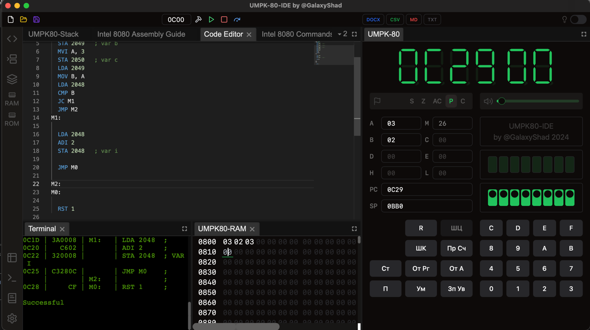

## Scriptoslav80
JS подобный **компилируемый и интерпертируемый** язык программирования.
Компилируется в ассемблер микропроцессора i8080 / КР580ВМ80А для удобной высокоуровневой разработки программ 
для лабораторного стенда УМПК-80.

## Задание ИТМО и ход выполнения
Разработать язык программирования, который должен реализовать следующие компоненты:

- Присваивание (оператор или операция)
    - [x] Интерпретатор
    - [x] Компилятор
- Арифметические операции
    - [x] Интерпретатор
    - [x] Компилятор
- Возможность изменения приоритета – скобочные формы. 
    - [x] Интерпретатор
    - [x] Компилятор
- Логические операции (== != > >= < <=)
    - [x] Интерпретатор
    - [x] Компилятор
- if
    - [x] Интерпретатор
    - [x] Компилятор
- else
    - [x] Интерпретатор
    - [x] Компилятор
- Поддержка целочисленного типа данных (i8)
    - [x] Интерпретатор
    - [x] Компилятор
- Поддержка логического типа данных (bool)
    - [x] Интерпретатор
    - [x] Компилятор
- Вывод значений переменных и констант (print)
    - [x] Интерпретатор
    - [+-] Компилятор
- Определение переменных с контролем их не- / пере- определения. (let/const)
    - [x] Интерпретатор
    - [x] Компилятор
- Цикл while
    - [x] Интерпретатор
    - [x] Компилятор
- [+-] Многострочные комментарии в стиле Си-подобных языков.
  ```
  /************************************
  **** строки комментариев ************
  *************************************/
  ```

## TODO
- [ ] Строковый тип 
- [ ] Реализация оператора ветвления if elif else вместо базового if 
- [ ] Реализация цикла for в дополнении к базовому while
- [ ] WEB Vue3 Code Editor and Interpreter Frontend

## Пример работы 
### Код на Scriptoslav80:
```
  let i = 1;
  let b = 2;
  let c = 3;
  
  if (i < b) {
    i = i + 2;
  } else {
    b = b + 2;
  }

  monitor.log(i);
  monitor.log(b);
```

### Результат интерпретации
```
3
2

-- done --
```

### Результат компиляции 
```
 ORG 0C00h
  MVI A, 1
  STA 2048   ; var i
  MVI A, 2
  STA 2049   ; var b
  MVI A, 3
  STA 2050   ; var c
  LDA 2049
  MOV B, A
  LDA 2048
  CMP B
  JC M1
  JMP M2
M1:
  LDA 2048
  ADI 2
  STA 2048   ; var i

  JMP M0
M2:
M0:
  RST 1

-- done --

```

### Результат работы скомпилированного кода в среде УМПК-80-IDE



